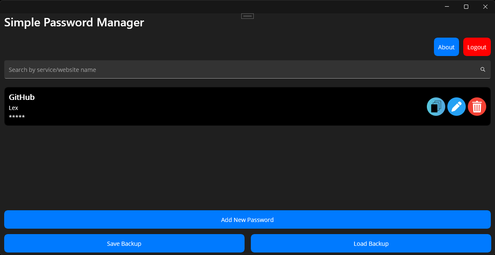
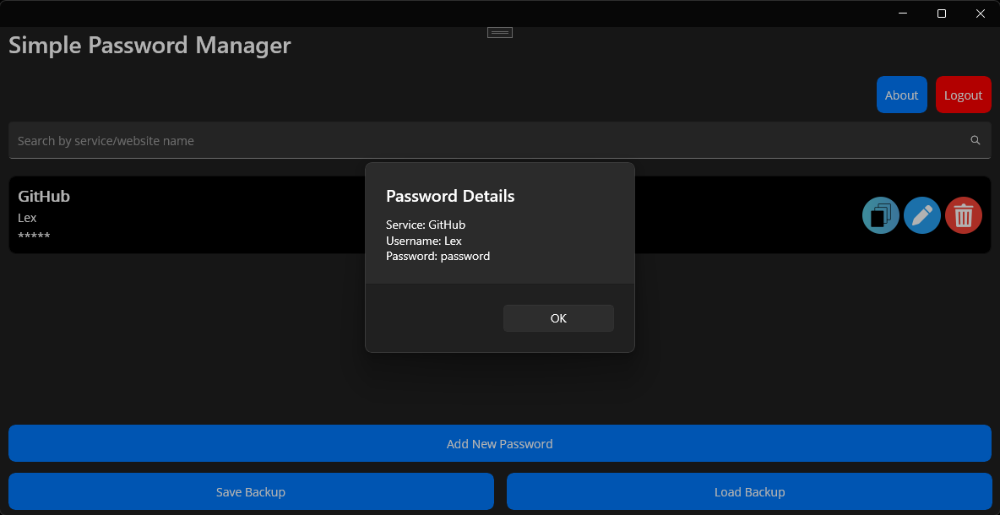
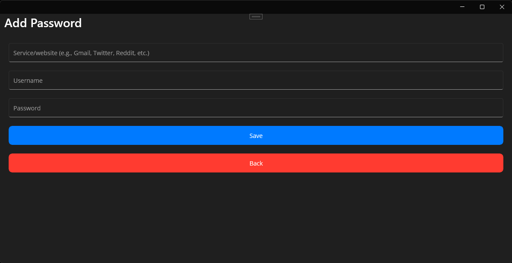

<h2 align="center">Simple Password Manager</h2>

Safety starts with understanding how developers collect and share your data. Data privacy and security practices may vary based on your use, region, and age. The developer provided this information and may update it over time.

## Features

- Simple registration: just create a username and password (no external accounts or personal emails required)
- Automatic password encryption
- 100% offline functionality for enhanced privacy
- Screenshot protection system
- Automatic screen dimming when switching apps
- Local backup creation
- Intuitive and easy-to-use interface

## Instructions for Windows

- Extract the contents somewhere, in Documents or C:/ is a good idea. Never extract the folder to C:/Program Files (x86) or any other system folder.
- Install Microsoft Windows Desktop Runtime 8.0.12 (x64) (if it is not installed on your system, running the application exe will take you to the website for download and installation).
- Inside the folder, find the executable PasswordManager.exe to use the application.

<h2 align="center">Captures</h2>

<h2 align="center">Download</h2>

